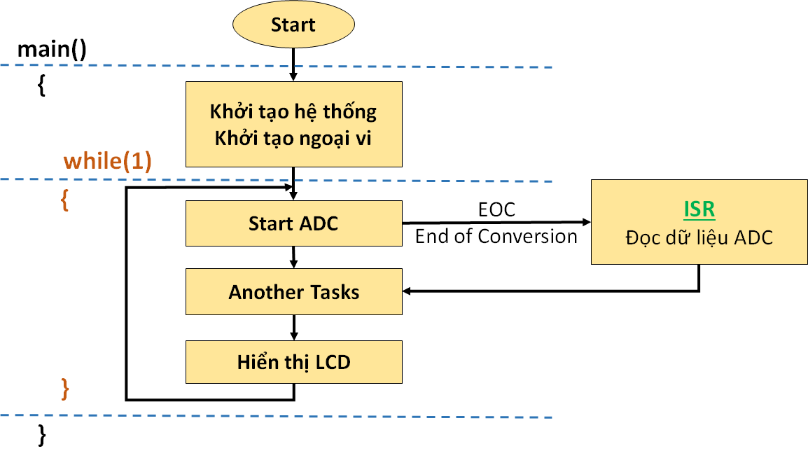
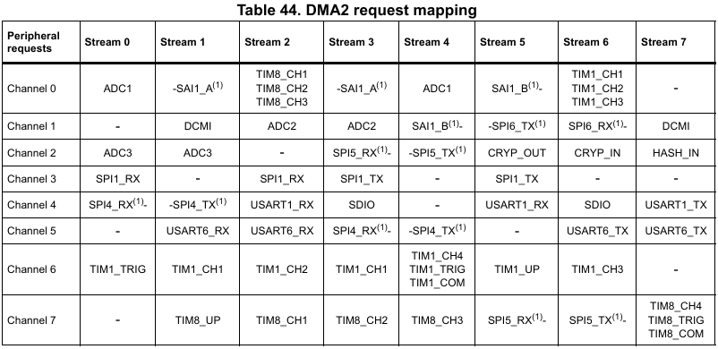

# Direct Memory Access(DMA)

## I. Giới thiệu chung
### 1. Các kỹ thuật thiết kế luồng xử lý trong chương trình nhúng
Bài toán Đọc dữ liệu từ cảm biến, dùng ADC, và hiển thị lên màn hình LCD. 

#### Polling

\- Cách mà chúng ta vẫn hay làm như vậy, trong vòng lặp while(1), gọi là kỹ thuật Polling - liên tục kiểm tra, liên tục thực thi. Mặc dù có một vài nhược điểm, nhưng polling cũng có những ưu điểm: Đơn giản, dễ hiểu, dễ thiết lập chương trình. Các hoạt động thực hiện rõ ràng, tuần tự, nên dễ Debug. \
\- Tuy nhiên, với các chương trình lớn, phức tạp hơn, đòi hỏi đáp ứng nhanh hơn, thì polling sẽ rất khó đáp ứng được. Polling trong các trường hợp này có thể gây mất các sự kiện  Chúng ta nên kết hợp thêm một số kỹ thuật thiết kế khác! 

#### Interrupt

- interrupt ⇒ ngắt/gián đoạn, nó có thể là sự thay đổi logic ở 1 chân nào đó, hoặc là sự tràn của một cờ, truyền hết 1 byte dữ liệu, ... Nó sẽ làm gián đoạn hoạt động của vòng lặp while(1). 

- Chẳng hạn thay vì liên tục kiểm tra nút bấm, ta cài đặt cho nó là 1 ngắt. Thì khi bấm nút, chương trình sẽ bị gián đoạn, và CPU phải kiểm tra xem điều gì đang xảy ra !!! Như bài toán trên, chúng ta có thể bắt đầu ADC, sau đó làm công việc khác, chờ nó chuyển đổi xong, nhảy vào ngắt đọc giá trị đo được, rồi lại tiếp tục chương trình.

- Ưu điểm là Interrupt là giúp chương trình đáp ứng nhanh với những cái ta cần. Có thể sử dụng chế độ tiết kiệm năng lượng khi vi điều khiển không làm gì.

- nhược điểm của nó là ta cần khống chế chương trình con thực thi ngắt ISR để tránh việc chương trình phục vụ một ngắt quá lâu. Lời khuyên là nên viết chương trình ISR càng ngắn về mặt thời gian càng tốt.

#### DMA
- DMA (Direct Memory Access), tức là truy cập trực tiếp bộ nhớ. Kỹ thuật này để sử dụng để truyền dữ liệu trực tiếp giữa bộ nhớ và ngoại vi mà không thông qua CPU (trong lúc này, CPU có thể làm việc khác nhờ thế tiết kiệm thời gian CPU rất nhiều). 

-  Ưu điểm của DMA là nó truyền dữ liệu nhanh hơn CPU, nhờ đó nâng cao hiệu suất của vi điều khiển & tiết kiệm năng lượng.
- nhược điểm là nếu dùng không hợp lý thì có khả năng nó sẽ tiêu thụ nhiều năng lượng hơn bình thường. Hơn nữa, phần cứng vi điều khiển cần phải hỗ trợ DMA nếu muốn sử dụng

### 2. Cơ chế Master-Slave trong vi điều khiển
- CPU sẽ điều khiển việc transfer data giữa Peripheral (UART, I2C, SPI, ...) và bộ nhớ (RAM) qua các đường bus. Cơ chế này được hiểu như cơ chế Master - Slave, với CPU đóng vai trò là Master, Peripheral và Memory đóng vai trò như các slave. Nên việc giao tiếp giữa 2 Slave sẽ do Master điều khiển.
- Tuy nhiên với việc CPU phải làm thêm 1 công việc quan trọng khác - Fetch lệnh từ bộ nhớ (FLASH) để thực thi các lệnh của chương trình. Vì vậy, khi cần truyền dữ liệu liên tục giữa Peripheral và RAM, CPU sẽ bị chiếm dụng, và không có thời gian làm các công việc khác, hoặc có thể gây miss dữ liệu khi transfer.
⇨ Chính vì vậy, hệ thống hỗ trợ một Master khác để chuyên làm công việc này, đó là DMA

## II. DMA trong STM32
### 1. Bus Matrix

- trong STM32 có 7 master bus và 7 slave bus
### 2. Các đặc điểm chính của DMA - STM32
- Kiến trúc Dual AHB master bus, một dành riêng cho truy cập bộ nhớ, một dành cho truy cập ngoại vi.
- 8 streams cho mỗi DMA Controller, lên đến 8 channel cho mỗi stream. Mỗi Stream có một bộ đệm FIFO để tối ưu băng thông của hệ thống.
- Hai mode: FIFO Mode và Direct Mode.
- Mỗi Stream có thể được cấu hình bởi Hardware:
\- Channel thông thường hỗ trợ transfer giữa 2 slave (Memory hoặc Peripheral). \
\- Channel Double Buffer hỗ trợ bộ đệm kép ở bộ nhớ.
- Các Channel có thể lập trình mức độ ưu tiên (4 mức - Very high, high, medium, low) hoặc hỗ trợ bởi Hardware khi mức ưu tiên ngang nhau (Channel 0 > Channel 1).
- Số lượng data items có thể được quản lý bởi DMA Controller hoặc Peripheral:
\- DMA Flow Controller: Số lượng items có thể lập trình được từ 1 đến 65535.\
\- Peripheral Flow Controller: Số lượng items không xác định, được điều khiển bởi Source/Destination Peripheral và kết thúc việc truyền bởi Hardware.
- Source và Destination có độ rộng dữ liệu độc lập (byte / half-word / word). Khi độ rộng của Data của Source và Destination không bằng nhau, DMA sẽ tự động đóng gói / giải nén các dữ liệu truyền đi để tối ưu hóa băng thông (Tính năng này chỉ dùng với FIFO Mode).
- Mỗi Stream đều hỗ trợ bộ quản lý Circular Buffer.
- Hỗ trợ 5 Event Flags (DMA Half Transfer, DMA Transfer Complete, DMA Transfer Error, DMA FIFO Error, Direct Mode Error).

- Bộ điều khiển DMA thực hiện truyền/nhận bộ nhớ một cách trực tiếp: Với vai trò AHB Master, DMA có thể nắm quyền điều khiển bus matrix AHB để bắt đầu các quá trình truyền nhận - Transactions. Nó có thể thực hiện các giao dịch sau:
\- Peripheral to Memory \
\- Memory to Peripheral \
\- Memory to Memory 

- Bộ điều khiển DMA cung cấp hai cổng chính(Master Port) và một cổng phụ(Slave Port):
\- Memory port (Master Port): \
\- Peripheral port (Master Port): \
\- Programming port (Slave Port): 

- Arbiter(khối trọng tải): có chức năng nhận yêu cầu từ các luồng(streams). điều khiển sự trao đổi dữ liệu giữa các cổng truyền
- mức ưu tiên của các luồng
\- DMA có 4 mức ưu tiên : Very High, High, Medium, Low
\- đối với trường hợi có cùng mức ưu tiên thì thứ tự ưu tiên: Stream_0 > ... > Stream_7 

## III. Cấu hình DMA trong STM32CubeMx
- Cấu hình UART DMA 
## IV. API
``` C
HAL_StatusTypeDef HAL_DMA_Start( DMA_HandleTypeDef *hdma, 
                                 uint32_t SrcAddress, 
                                 uint32_t DstAddress, 
                                 uint32_t DataLength );
```
``` C
HAL_StatusTypeDef HAL_DMA_Start_IT( DMA_HandleTypeDef *hdma, 
                                    uint32_t SrcAddress, 
                                    uint32_t DstAddress, 
                                    uint32_t DataLength );
```
``` C
HAL_StatusTypeDef HAL_DMA_RegisterCallback( DMA_HandleTypeDef *hdma, 
                                            HAL_DMA_CallbackIDTypeDef CallbackID, 
                                            void (* pCallback)(DMA_HandleTypeDef *_hdma) );
```

``` C
HAL_StatusTypeDef HAL_DMA_PollForTransfer( DMA_HandleTypeDef *hdma, 
                                           HAL_DMA_LevelCompleteTypeDef CompleteLevel, 
                                           uint32_t Timeout);
```

## V. Cấu hình thanh ghi
### 1. Cấu trúc thanh ghi
1. Cấu trúc thanh ghi DMA
``` C
typedef struct
{
    volatile uint32_t LISR;
    volatile uint32_t HISR;
    volatile uint32_t LIFCR;
    volatile uint32_t HIFCR;
}DMA_RegDef;
```
2. Cấu trúc thanh ghi DMA_Streamx
``` C
typedef struct
{
    volatile uint32_t CR;
    volatile uint32_t PAR;
    volatile uint32_t M0AR;
    volatile uint32_t M1AR;
    volatile uint32_t FCR;
}DMA_Stream_RegDef;
```
### 1. Cấu hình cơ bản
1. bật đồng hồ ngoại vi cho DMA 
   - AHB1ENR(RCC) : DMA1(bit 21)/ DMA2(bit 22) 

2. xác định luồng(Stream) và số kênh(Channel) phù hợp với thiết bị ngoại vi: STREAM 0 :
    - DMA request mapping
 \
 
    - Chọn luồng: DMA_Stream x(x= 0:7)
    - chọn kênh : 


3.  Hướng truyền dữ liệu : m2p, p2m , m2m và Lập trình địa chỉ nguồn và địa chỉ đích


4. Lập trình số dữ liệu cần gửi
    - DMA_Streamx->NDTR = số lượng dữ liệu
5. Lập trình chiều rộng dữ liệu nguồn và đích
    - DMA_Streamx->CR->PSIZE[1:0]: Peripheral data size
    - DMA_Streamx->CR->MSIZE[1:0]: Memory data size
        - 00: byte (8-bit)
        - 01: half-word (16-bit)
        - 10: word (32-bit)
        - 11: reserved
6. bật tăng bộ nhớ tự động(option)
    - DMA_Streamx->CR->MINC: Memory increment mode
    - DMA_Streamx->CR->PINC: Peripheral increment mode
        - 0: Memory address pointer is fixed
        - 1: Memory address pointer is incremented after each data transfer (increment is done) 
7.  chế độ trực tiếp hoặc chế độ FIFO 
    - DMA_Streamx->FCR->DMDIS
      - 0: Direct mode enabled
      - 1: Direct mode disabled 
8.  Chọn ngưỡng FIFO
    - DMA_Streamx->FCR->FS[2:0]: FIFO status
        -  000: 0 < fifo_level < 1/4 
        - 001: 1/4 ≤ fifo_level < 1/2 
        - 010: 1/2 ≤ fifo_level < 3/4
        - 011: 3/4 ≤ fifo_level < full
        - 100: FIFO is empty
        - 101: FIFO is full

9.  bật circular mode(option)
    - DMA_Streamx->CR->CIRC:  Circular mode
        - 0: Circular mode disabled
        - 1: Circular mode enabled 
    - ``note:``
        - Khi (bit PFCTRL=1) và (bit EN=1), thì bit này sẽ tự động bị phần cứng ép về 0.
        - Nó sẽ tự động bị phần cứng ép về 1 nếu bit DBM được đặt, ngay khi luồng được bật (bit EN ='1'). 
10. truyền đơn(single) hoặc truyền theo đợt(blust).
    
11. Cấu hình mức độ ưu tiên của luồng 
    - DMA_Streamx->CR->PL[1:0]:
        - 00: Low
        - 01: Medium
        - 10: High
        - 11: Very high  


### 2. Cấu hình ngắt

- vector ngắt
``` C
void DMA1_Streamx_IRQHandler(void) // x: 0-7
{
    // interrupt handler
}
void DMA2_Streamx_IRQHandler(void) // x: 0-7
{
    // interrupt handler
}
```


